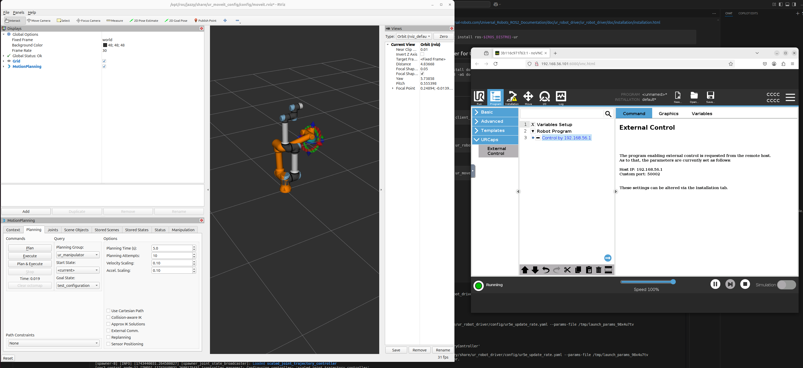

# ros2-ur-moveit-demo
A ROS2 UR MoveIt demo.

## Installation

### Virtual Machine
VM is nice for easy fun. Used VMWare Workstation Pro and made an Ubuntu 24.04 VM.

- 8GB RAM
- 50 GB storage
- 2 CPU cores

### ROS2 install steps
History of commands for install of ROS2 Jazzy in VM. Resulting steps from https://docs.ros.org/en/jazzy/Installation/Ubuntu-Install-Debs.html

```bash
sudo apt-get update
sudo apt-get upgrade

sudo apt update && sudo apt install curl -y
sudo curl -sSL https://raw.githubusercontent.com/ros/rosdistro/master/ros.key -o /usr/share/keyrings/ros-archive-keyring.gpg
echo "deb [arch=$(dpkg --print-architecture) signed-by=/usr/share/keyrings/ros-archive-keyring.gpg] http://packages.ros.org/ros2/ubuntu $(. /etc/os-release && echo $UBUNTU_CODENAME) main" | sudo tee /etc/apt/sources.list.d/ros2.list > /dev/null

sudo apt update
sudo apt upgrade

sudo apt install ros-jazzy-desktop
sudo apt install ros-dev-tools

echo "source /opt/ros/jazzy/setup.bash" >> ~/.bashrc
```

### Universal Robots install steps

https://docs.universal-robots.com/Universal_Robots_ROS2_Documentation/doc/ur_robot_driver/ur_robot_driver/doc/installation/installation.html

```bash
sudo apt-get install ros-${ROS_DISTRO}-ur
```

## Install Docker for URSim

```bash
sudo apt install docker.io
sudo usermod -aG docker $USER
```

## Start

Terminal 1:
```bash
ros2 run ur_client_library start_ursim.sh -m ur5e
```

Terminal 2:
```bash
ros2 launch ur_robot_driver ur_control.launch.py ur_type:=ur5e robot_ip:=192.168.56.101 launch_rviz:=false
```

Terminal 3:
```bash
ros2 launch ur_moveit_config ur_moveit.launch.py ur_type:=ur5e launch_rviz:=true
```

Go to http://192.168.56.101:6080/vnc.html, start robot, make a program with External Control URCap.

Start planning some start and end goals.

Expected result



## Plan a trajectory
do it.

~~sudo apt install ros-jazzy-moveit-py~~

## Try some cpp

https://moveit.picknik.ai/main/doc/tutorials/your_first_project/your_first_project.html#your-first-c-moveit-project

Terminal 4:

`mkdir -p ~/workspaces/ws_moveit/src`

`cd ~/workspaces/ws_moveit/src`

Copy the `hello-moveit` folder to `src`

cd ~/workspaces/ws_moveit

`colcon build --mixin`

`ros2 run hello_moveit hello_moveit`

the robot moves in RViz and URSim.
